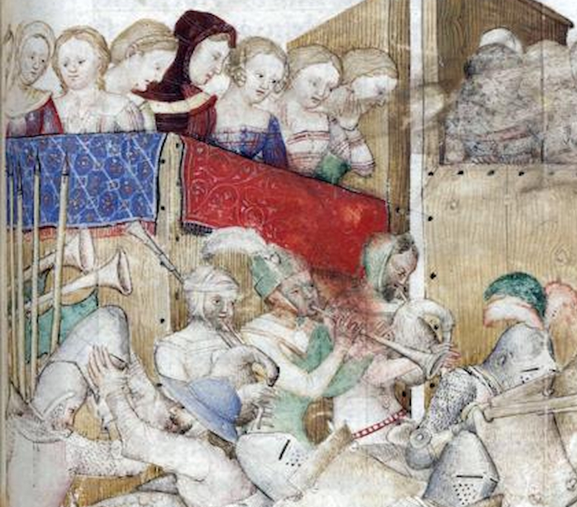

Il Medioevo è un'epoca **piena di musica**. Non c'è luogo dove non la si possa
udire: c'è musica in chiesa, naturalmente, ma dalla chiesa la musica esce sui
sagrati, con le Laude e le prime drammatizzazioni delle storie sacre.

Naturalmente, anche sul **campo di battaglia** c'è musica, o almeno strumenti
musicali: si tratta invariabilmente di strumenti della cosiddetta "**alta
cappella**", ossia che offrono un volume consistente, per dare ordini udibili
nell'infuriare del combattimento: **tamburi** e **trombe**, i primi che vengono
in mente, ma anche **cornamuse**.

Cornamuse? Ma non sono strumenti tipicamente scozzesi? In verità, no: sono
diffusi in tutta l'Europa medievale, in particolare in Italia. Di seguito
vediamo l'immagine di un **torneo** in cui, nell'angolo in alto a sinistra,
sotto il palco delle donne, si vedono due suonatori di cornamusa. L'immagine è
tratta da un manoscritto milanese del 1370 circa.

_Dettaglio da un manoscritto milanese del 1370 circa: due suonatori di cornamusa durante un torneo medievale._

E, infine, anche negli **accampamenti** risuonano note e canti: le canzonacce
sguaiate dei militi, qualcuno che si è portato dietro uno strumento musicale e
si accompagna, qualcun altro che fa baldoria, contento di averla scampata anche
questa volta.

I **Mercenari del Labirinto**, fedeli a questa tradizione, portano nel loro
accampamento anche strumenti musicali medievali, proponendo momenti di **musica
e canti**.
