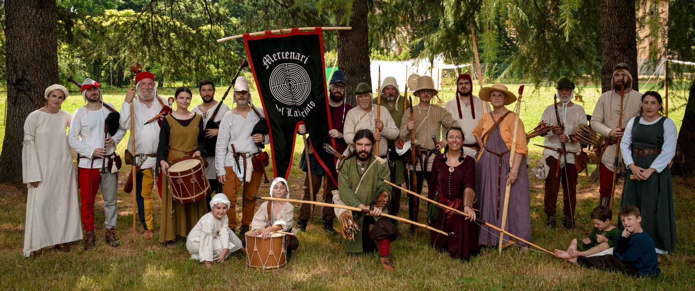

L’associazione sportivo dilettantistica **Mercenari del Labirinto** è nata a
Lucca nel 2021 dall’iniziativa di un gruppo di appassionati di rievocazione
storica medievale e sport. L’associazione ha come obiettivo la promozione e
l’organizzazione di attività di rievocazione storica, unite alla pratica
sportiva e alla divulgazione culturale.

Il principale ambito storico di riferimento è l’**Italia** del XIV secolo,
ricostruita attraverso uno **studio attento delle fonti storiche** e un lavoro
costante di ricerca e sperimentazione. Abbigliamento, equipaggiamenti e pratiche
sportive vengono ricreati con attenzione alla coerenza storica, mantenendo un
approccio rigoroso ma accessibile anche al pubblico non specialista.
L’associazione collabora inoltre con altre realtà rievocative, attive su periodi
storici differenti, favorendo il confronto e la crescita reciproca.

L’attività sportiva centrale dell’associazione è il **tiro con l’arco**,
praticato con tecnica istintiva. I soci partecipano regolarmente a campionati,
tornei e manifestazioni sportive affiliati al CONI, sia di tiro storico in
costume sia di tiro dinamico, contribuendo alla diffusione di una disciplina che
unisce tradizione, tecnica e competizione.

Accanto all’attività sportiva, i Mercenari del Labirinto prendono parte a
rievocazioni storiche, eventi culturali, manifestazioni pubbliche e iniziative
didattiche, con l’intento di avvicinare il pubblico alla **storia medievale**
attraverso un’esperienza diretta, coinvolgente e concreta.
